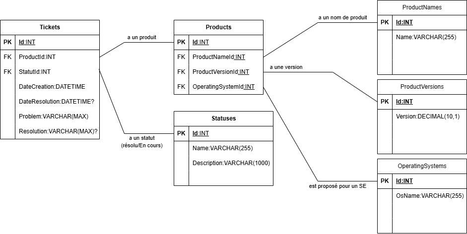

# OCP6NET
Dépôt du projet 6 du parcours Développeur Back-End .NET.

## Contenu du projet
Ce projet possède :
- Une image du Model-Entity-Association (MEA) de la base de données : "**Model_Entity_Association.png**".
- 1 Fichier SQL pour la création de la base de données, des tables et l'insertion des données : "**1.CreateTableAndPopulate.sql**".
- 1 Fichier SQL pour la création des procédures stockées : "**2.CreateStoredProcedure.sql**".
- 1 Fichier SQL pour l'exécution des procédures stockées' : "**3.ExecuteStoredProcedures.sql**".
- 1 Fichier de base de données SQL Server à importer/restaurer dans votre serveur de bases de données : "**NexaWorksTicketsDb.bak**".

**Remarque** : La base de données a été créée et exportée à l'aide de SQL Server 2022 Express Edition.

## Installation de la base de données

Avant de commencer, je suppose que vous avez déjà installé **SQL Server** et **SQL Server Management Studio (SSMS)** sur votre ordinateur.
Pour installer la base de données NexaWorksTicketsDb, vous pouvez suivre l'une des deux méthodes suivantes :

### Importer/Restaurer la base de données
1. Ouvrir SQL Server Management Studio (SSMS).
2. Se connecter à votre instance de SQL Server.
3. Restaurer la base de données à partir du fichier **NexaWorksTicketsDb.bak** :
   - Clic droit sur "Bases de données" > "Restaurer la base de données..."
   - Sélectionner "Support :" dans le groupe "Source"
   - Clic sur "..." pour choisir le fichier de sauvegarde.
   - Sélectionner "Fichier" pour le type de support de sauvegarde.
   - Clic sur "Ajouter" pour sélectionner le fichier **NexaWorksTicketsDb.bak** dans le répertoire du projet.
   - Clic sur "OK"
   - Clic sur "OK"
   - Vérifier que la base de données a restaurer est bien sélectionnée.
   - Clic sur "OK" pour lancer la restauration.

### Exécuter les scripts SQL
Si vous souhaitez créer la base de données et les tables manuellement, vous pouvez exécuter les scripts SQL fournis dans l'ordre suivant :
1. **1.CreateTableAndPopulate.sql** : Ce script crée la base de données, les tables et insère des données initiales.
2. **2.CreateStoredProcedure.sql** : Ce script crée les procédures stockées pour la gestion des tickets.
3. **3.ExecuteStoredProcedures.sql** : Ce script exécute les procédures stockées pour tester leur fonctionnement.

## Modèle de données

La base de données est conçue pour gérer les tickets de support NexaWorks. Voici un aperçu du modèle d'entité-association (MEA) :

Pour créer un ticket, il est nécessaire de spécifier un produit et un status indiquant si le problème est résolu ou en cours de résolution. 

Un ticket est associé à :
- Un produit,
- Un status

Un produit est associé à :
- Un nom de produit,
- Une version de produit,
- Un système d'exploitation supporté.

